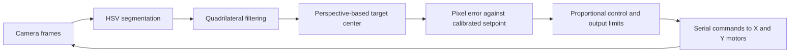

# Vision-Based Automatic Aiming System

**Raspberry Pi · OpenCV · Dual-axis motor control · 2025 Electronic Design Competition**

[中文说明](README.zh-CN.md)

## Final competition version

[Final script](final/ypy_key_jiguang_timer_new.py): the final configuration confirmed by our team triggers the GPIO output approximately **2 seconds after the start button is pressed**. This copy was prepared from the separately supplied script by changing its timer from 4 to 2 seconds, including the default argument and comments. It retains the (320, 208) pixel setpoint and updated Y-axis direction settings. It passed static syntax parsing; this prepared copy has not been tested on the hardware.

The 12 scripts under `examples/` remain intermediate debugging versions. The final script uses elapsed-time triggering, independent of alignment success.

A computer vision project for locating a rectangular target and adjusting a two-axis aiming mechanism. This repository contains 12 intermediate Python scripts saved during our team's development and debugging process for the 2025 Electronic Design Competition. They document iterations in vision, motor control, button interaction, and triggering logic, rather than the final competition submission.

## System overview



The vision pipeline uses color thresholding, morphological closing, contour approximation, and aspect-ratio filtering. A perspective transform locates the rectangle center in image coordinates. The controller compares that center with a calibrated pixel setpoint and sends commands to the motor axes.

Although the scripts expose PID parameters, the archived integral and derivative gains are zero. Active control is primarily proportional, with output limiting.

## Implemented features

- Rectangular target search and tracking; single-axis and dual-axis variants.
- Button-triggered startup using Raspberry Pi GPIO.
- Alignment-based output when both pixel errors are below a threshold.
- Fixed-delay output, including an independent `threading.Timer` implementation.
- Purple laser-spot detection and visualization in an experimental variant.
- Custom serial command framing with an XOR checksum.

## Code guide

| Directory | Contents |
| --- | --- |
| [single_axis](examples/single_axis/) | Three single-axis variants |
| [dual_axis](examples/dual_axis/) | Two dual-axis calibration variants |
| [button_control](examples/button_control/) | Two button-start variants |
| [aim_trigger](examples/aim_trigger/) | Alignment-error-triggered output |
| [timed_trigger](examples/timed_trigger/) | Blocking-delay and independent-timer variants |
| [laser_detection](examples/laser_detection/) | Purple laser detection alongside target tracking |
| [hardware_tests](examples/hardware_tests/) | GPIO button test |

Start with [the independent-timer variant](examples/timed_trigger/ypy_key_jiguang_timer_new.py) for the integrated flow. Compare it with [the alignment-triggered variant](examples/aim_trigger/ypy_2_key_jiguang.py) to understand elapsed-time versus error-based triggering. Both are intermediate development versions.

## Hardware and setup

| Interface | Configuration in dual-axis/button variants |
| --- | --- |
| Host | Raspberry Pi with `RPi.GPIO`; exact model not recorded |
| Camera | OpenCV camera index 0; typically configured for 640 × 480 |
| X-axis serial | `/dev/ttyAMA3`, 115200 baud |
| Y-axis serial | `/dev/ttyAMA0`, 115200 baud |
| Start button | BCM GPIO 17, pull-up input, active low |
| Trigger output | BCM GPIO 27; labeled as a buzzer in source |

The motor-driver model and wiring diagram are not included. Check pin assignments, serial protocol, motor direction, and calibration before running. Some scripts initialize serial ports and GPIO at import time.

On a compatible Raspberry Pi environment:

```bash
python3 -m pip install -r requirements.txt
python3 examples/hardware_tests/key_test.py
# After checking the hardware configuration:
python3 examples/timed_trigger/ypy_key_jiguang_timer_new.py
```

OpenCV display windows require a graphical session. Dependency versions are unpinned because the original environment was not recorded. `RPi.GPIO` compatibility depends on the Raspberry Pi model and OS.

## Validation and limitations

All 12 scripts passed static Python syntax parsing during repository preparation. Original source bytes were preserved; hashes and parsing results are recorded in [the source manifest](docs/source-manifest.json). No hardware execution or competition-performance validation was performed during this preparation.

- The independent timer fires approximately four seconds after the button press regardless of alignment success.
- Its target-loss search branch is disabled by `if 0:`.
- Purple laser coordinates are displayed but do not drive the feedback error, which uses a fixed pixel setpoint.
- PID state is not fully separated between axes; integral or derivative control would require a review.
- Calibration differs between variants. Some comments in `aaa.py` have encoding issues.
- Quantitative accuracy, repeatability, timing measurements, demonstration footage, and individual team contributions are not documented yet.

This repository is an archival implementation with documented limitations. The Chinese guide provides a file-by-file description. IDE metadata and the competition problem PDF are not included.
